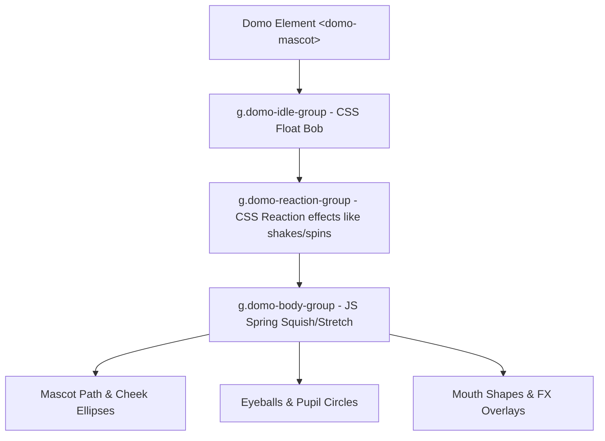

# Architecture & Developer Manual: hello.pudomo.com (Domo's Play-Hub)

Welcome to the technical handbook for the **hello.pudomo.com** codebase. This document outlines the system architecture, mathematical equations, asset structures, and UX patterns implemented for **Domo**, our interactive, squishy mascot.

Use this document to onboard developers, guide future AI sessions, and make additions/tweaks to the animation physics, visual assets, or audio engine.

---

## 1. Directory & Codebase Structure

The project is structured as a lean, zero-dependency static application built on **Vite**:

```text
hello-pudomo/
├── index.html            # Entry HTML root & viewport rules
├── package.json          # Vite developer scripts & packages
├── vite.config.js        # Local dev hosting configuration (Wi-Fi exposed)
├── README.md             # High-level repo onboarding
├── TECH_SPEC.md          # Architectural blueprints and checklists
├── ARCHITECTURE.md       # [THIS FILE] In-depth math & code manuals
└── src/
    ├── main.js           # Core Web Component, physics loops, and Web Audio synths
    └── style.css         # Brand design tokens, layout safeties, and reaction keyframes
```

---

## 2. Mascot Anatomy (SVG Layers)

Domo is built directly inside `<domo-mascot>` using inline SVG inside a `200 x 200` pixel grid viewport. 

To prevent animation overwrites, the SVG elements are nested inside **three composition layers** that separate CSS and JavaScript transforms:



### SVG Layout Coordinates:
* **Ground Shadow:** `<ellipse cx="100" cy="172" rx="55" ry="8" />` (Fades/scales in CSS in sync with idle bobs).
* **Base Body:** `<path d="M 40,110 C 40,65 70,45 100,45 C 130,45 160,65 160,110 C 160,150 135,168 100,168 C 65,168 40,150 40,110 Z" />` (Soft egg-like pear shape).
* **Eyeball Scleras (Centers):** Left `(75, 88)`, Right `(125, 88)`, Radius `16`.
* **Pupil Circles (Default):** Left `(75, 88)`, Right `(125, 88)`, Radius `6.5`.
* **Hats/Accessories Translation Points:** Located at center-top: `(100, 36)` for the crown, `(100, 42)` for the party hat, and `(100, 88)` for sunglasses.

---

## 3. Mathematical & Physics Specifications

### A. Squishing Physics (Hooke's Law Spring)
When Domo is pressed or fed, we do not animate scale linearly. We use a spring physics simulation running on `requestAnimationFrame`:

$$\text{acceleration}_x = (\text{targetScale}_x - \text{scale}_x) \times \text{stiffness} - \text{velocity}_x \times \text{damping}$$
$$\text{velocity}_x = \text{velocity}_x + \text{acceleration}_x$$
$$\text{scale}_x = \text{scale}_x + \text{velocity}_x$$

* **Stiffness (`0.08`):** Controls the speed of recovery. Lower is softer; higher is snappier.
* **Damping (`0.80`):** Acts as friction. Lower reduces wobble; higher makes him springy and gel-like.
* **The Ground Anchor (Pivot Point):** In `style.css`, `.domo-body-group` is forced to `transform-origin: 100px 160px`. This bottom-center point anchors him to the floor, forcing him to squish outwards horizontally and flatten down vertically, obeying the animation principle of **Squash and Stretch**.

### B. Eye Tracking Trigonometry
Pupil coordinates track pointers using arctangent calculations:

1. Retrieve the eyeball centers in client screen space using `getBoundingClientRect()`.
2. Compute the delta vectors to the cursor: $dx = x_{\text{cursor}} - x_{\text{eye}}$, $dy = y_{\text{cursor}} - y_{\text{eye}}$.
3. Determine the angle: $\theta = \text{Math.atan2}(dy, dx)$.
4. Clamp the pupil displacement distance to prevent it from escaping the sclera boundary: 
   $$\text{displacement} = \min(4.5\text{px}, \sqrt{dx^2 + dy^2} / 32)$$
5. Reposition the pupil circles by modifying their SVG attributes directly (avoiding Safari coordinate translation bugs):
   $$cx = cx_{\text{default}} + \cos(\theta) \times \text{displacement}$$
   $$cy = cy_{\text{default}} + \sin(\theta) \times \text{displacement}$$

---

## 4. Web Audio API Voice Synth Engine

To remain light and cost-free, all sound is generated programmatically inside the user's browser:

### A. Pop-Free Ramping Envelope
Turning an oscillator node on and off instantly causes an electrical pop in headphones. We use a `GainNode` envelope to smooth the sound wave:

* **Rise:** Linear ramp from `0` gain to `0.08` gain over `5ms`.
* **Decay:** Exponential decay to `0.0001` over the note's duration.

### B. Snack Pitch & Waveform Matrix:

| Snack | Waveform | Pitch Range (Hz) | Duration (ms) | Interval |
| :--- | :--- | :--- | :--- | :--- |
| **Default Speech** | `triangle` | $300 - 450$ | $75$ | $80\text{ms}$ |
| 🌶️ **Chili** | `triangle` | $200 - 280$ | $55$ | $60\text{ms}$ (rapid) |
| 🎈 **Balloon** | `sine` | $650 - 850$ | $85$ | $95\text{ms}$ (squeaky) |
| ⚡ **Spark** | `sawtooth` | $400 - 700$ | $65$ | $70\text{ms}$ (zap) |
| ☕ **Espresso** | `triangle` | $800 - 1000$ | $40$ | $45\text{ms}$ (hyper) |
| 🧊 **Frost** | `sine` | $900 - 1200$ | $110$ | $120\text{ms}$ (chime) |
| 👑 **Star** | `sine` | Major Triad (C4->E4->G4->C5) | $450$ | Plays a chord sequence |

### C. Mobile Autoplay & iOS Safe Audio Initialization
Browsers prevent page-load audio to protect users. We handle this with a dual approach:
1. **The Invitation Badge (`?msg=...` parameter):** When custom greetings are detected, audio is blocked. We show a floating badge overlay. We attach listeners to **both** `click` and `touchstart` on the window. 
2. **Gesture Unlock:** The first touch triggers `domo.initAudio()`, creating the browser's `AudioContext` and resuming it instantly in the exact touch-gesture loop tick. This bypasses the mobile block (specifically on Android Chrome and iOS Safari) before starting typewriter text.

---

## 5. Snack Customization Guide (How to add a snack)

To add a new snack (e.g. `🍋 Lemon` / `state-sour`), execute these three steps:

### Step 1: Add to JS Tray Array
Inside `initSnackTray()` in `src/main.js`, add your snack object:
```javascript
{ name: 'Lemon', emoji: '🍋' }
```

### Step 2: Write the CSS Reactions in `src/style.css`
Define your keyframes and classes:
```css
/* Turn green-yellow */
.state-sour #domo-body {
  fill: #D4E157 !important;
}
/* Shiver/spin the reaction group */
.state-lemon-pucker {
  animation: pucker 0.4s ease infinite alternate;
}
@keyframes pucker {
  0% { transform: scaleX(0.8) scaleY(1.2); }
  100% { transform: scaleX(1.2) scaleY(0.8); }
}
```

### Step 3: Add Reaction Case in `triggerReaction()`
In `src/main.js`, add a new case to handle the expression, FX, speech text, and audio type:
```javascript
case 'Lemon':
  this.setEyeState('squinting-happy');
  this.classList.add('state-sour');
  this.reactionGroup.classList.add('state-lemon-pucker');
  
  // High-pitch sour speaking
  this.speakMessage("SO SOUR! My face is puckering!", 500, 700, 90, 'sine');
  
  this.activeReactionTimer = setTimeout(() => {
    this.resetReactionState();
  }, 3000); // 3 seconds timeout
  break;
```

---

## 6. Deployment & Hosting (Cloudflare Pages)

The app compiles into a 100% static payload. No node servers, no database configurations.

### Configuration Settings:
* **Build Command:** `npm run build`
* **Output Folder:** `dist`
* **Local Preview Command:** `npm run preview`
* **Wi-Fi Mobile Testing:** `vite.config.js` is set to `host: true`. Restarting the server (`npm run dev`) prints your local IP (e.g. `http://192.168.1.12:3000`), allowing physical iPhone/Android testing.

### Domain Setup:
1. In Cloudflare Pages dashboard, go to your project page -> **Custom Domains**.
2. Add your custom domain: `hello.pudomo.com`.
3. Cloudflare will automatically provision a free SSL certificate (HTTPS) and configure the CNAME redirection entries.
